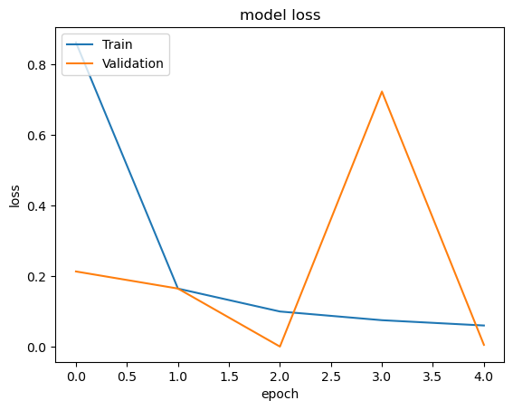
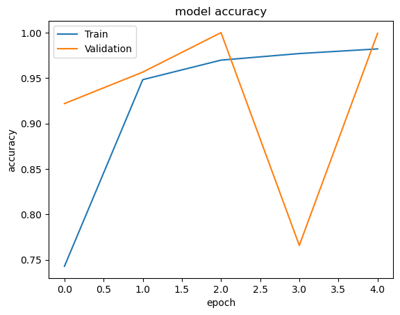
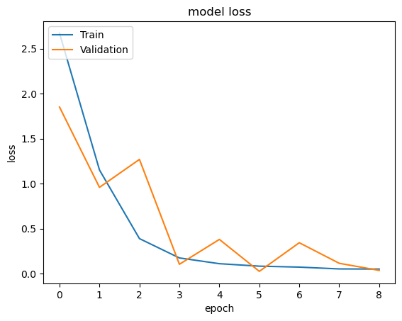
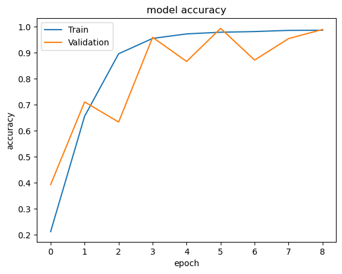

# Indian Sign Language Classification using Transfer Learning

ISL classification with Custom CNN and Resnet50

<table>
<th>Dataset</th>
<th>Notebook</th>
<tr>
<td><a href="https://www.kaggle.com/datasets/vaishnaviasonawane/indian-sign-language-dataset">Link</a>
</td>
<td><a href="https://www.kaggle.com/code/notshrirang/isl-classification">Link</a></td>
</tr>
</table>


## Accuracy and Losses
<table>
<th>Model Name</th>
<th>Accuracy</th>
<th>Loss Curves</th>
<th>Accuracy Curves</th>
<tr>
<td>
Custom CNN
</td>
<td>
98.38%
</td>
<td>

</td>
<td>

</td>
</tr>
<tr>
<td>
Transfer Learning - ResNet50V2 - Model 1
</td>
<td>
99.93%
</td>
<td>

</td>
<td>

</td>
</tr>
<tr>
<td>
Transfer Learning - ResNet50V2 - Model 2
</td>
<td>
98.95%
</td>
<td>

</td>
<td>

</td>
</tr>
</table>

## Installing Requirements
```
pip install -r requirements.txt
```

## Get trained models
<table>
<th>Model Name</th>
<th>Size</th>
<th>Link</th>
<tr>
<td>
Custom CNN
</td>
<td>
799 KB
</td>
<td>
<a href="https://github.com/NotShrirang/Indian-Sign-Language-Classification-using-Transfer-Learning/releases/download/v0.0.1/model_1_aug.h5">Download</a>
</td>
</tr>
<tr>
<td>
Transfer Learning - ResNet50V2 - Model 1
</td>
<td>
205 MB
</td>
<td>
<a href="https://github.com/NotShrirang/Indian-Sign-Language-Classification-using-Transfer-Learning/releases/download/v0.0.1/tl_model_1.h5">Download</a>
</td>
</tr>
<tr>
<td>
Transfer Learning - ResNet50V2 - Model 2
</td>
<td>
206 MB
</td>
<td>
<a href="https://github.com/NotShrirang/Indian-Sign-Language-Classification-using-Transfer-Learning/releases/download/v0.0.1/tl_model_2.h5">Download</a>
</td>
</tr>
</table>
